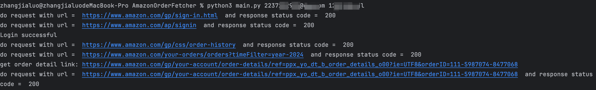
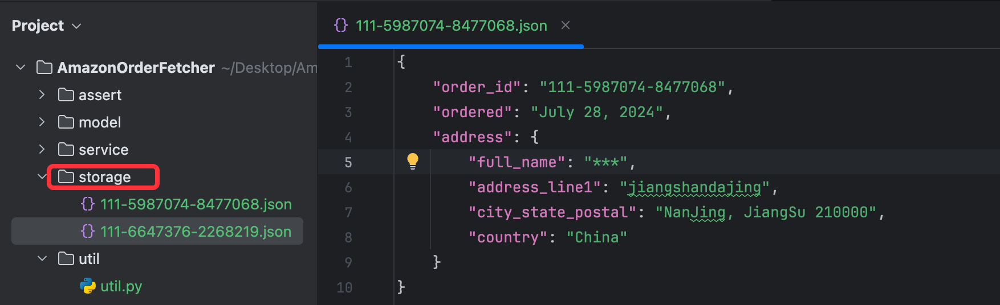
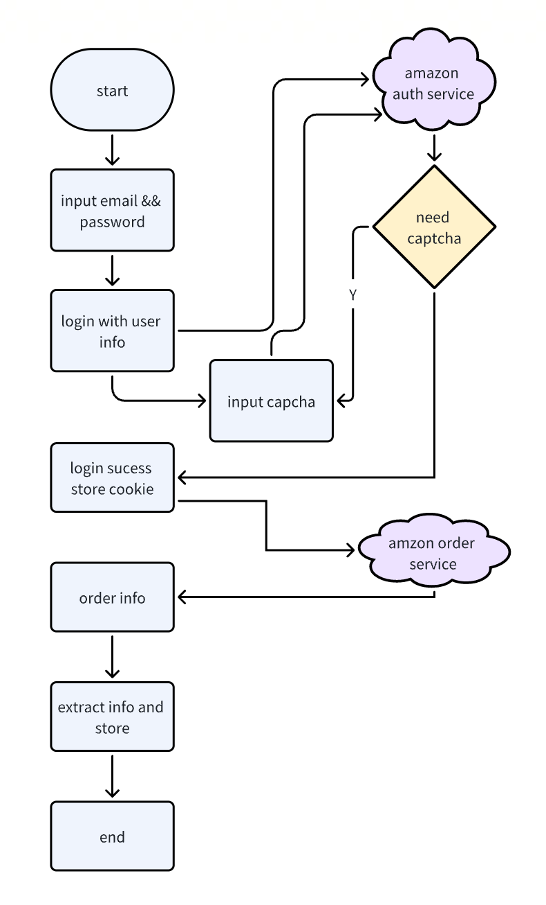

This is an MVP version of library that download amazon order to json file. Currently, this version just support login when
amazon not let client login by captcha.
# Installation
First you should clone this project to you mac or widonws. And you should install python3 and pip3.  
````
git clone git@github.com:javacode123/AmazonOrderFetcher.git
````
# Usage
You can use command to start run this program.
```
python3 main.py your_email your_password
```
Here is a example. It will auto login and down orders to assert dir.


# TODO
As i say, this is just a MVP version. There are still many features to be done.  
- [ ] login with captcha
- [ ] abstract code with form class to support login
- [ ] add logging to replace print
- [ ] query orders use page number
- [ ] extract more info about order info
- [ ] add conf file support config some features
- [ ] add unit tests
- [ ] support logout
- [ ] process exception
# Tech Design
## Requirement
- The agent should navigate to the "Order Details" page of each historical order of a particular user. 
- The agent should save the corresponding page as raw HTML files in a structured format (e.g., using a naming convention that includes the order number and date).
- The agent should extract key order details from the HTML files, such as order number, product names, quantities, prices, and delivery status, and store them in a structured format (e.g., JSON or CSV).
- The agent should make a decision to stop the process once all of the orders are fetched successfully. 
## Solution Research
- How to mock login
- Analyse amazon login logic
- How to get order info from html
## Architecture

## Code Structure
```angular2html
AmazonOrderFetcher/  
│  
├── assert/ # image resource  
│   ├── arch.png  
│   ├── img.png  
│   ├── storage.png  
│  
├── models/  
│   ├── order.py # order model, extract model info   
│  
├── service/ # core biz logic  
│   ├── client.py # used to login  
│   ├── constants.py  
│   ├── constants.py  # order service used to query order info  
│  
├── storage/ # used to store order info   
│   ├── {order_id}.json     
│  
├── utils/  
│   ├── util.py  
│  
├── main.py  
├── README.md   

```